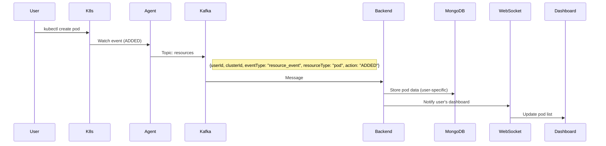
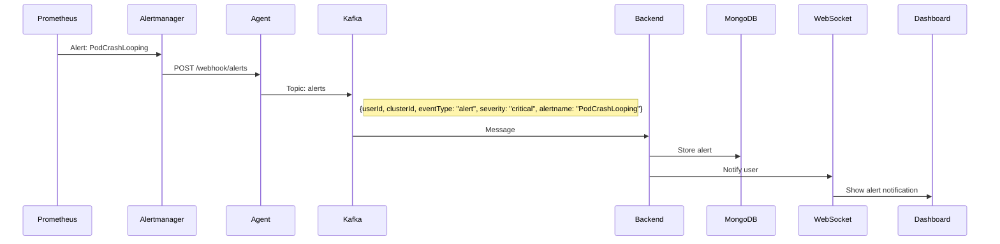
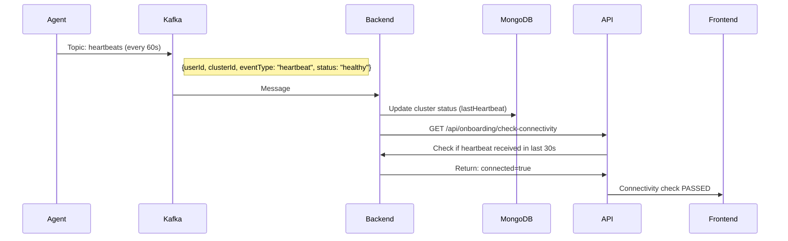

# DevOps Copilot - Complete Cluster Agent Implementation

## Summary of What Was Built

I've created a complete Kubernetes cluster agent that monitors user clusters and sends data to your Kafka-based SaaS platform with full multi-tenant isolation.

---

## 📁 Files Created

### 1. **cluster-agent/app.py** - Main Agent Application (Python/Flask)
**Purpose**: Core monitoring agent that runs in user clusters

**Key Features**:
- ✅ **Kubernetes Resource Watching**: Monitors Pods, Deployments, Events in real-time
- ✅ **Kafka Producer**: Sends all data to your Kafka cluster with user context
- ✅ **Service Account**: Uses in-cluster auth (no kubeconfig needed)
- ✅ **Multi-tenant Headers**: Every message tagged with `userId`, `clusterId`, `clusterName`
- ✅ **Heartbeat System**: Sends periodic heartbeats for connectivity checking
- ✅ **Alertmanager Webhook**: Receives alerts from Alertmanager and forwards to Kafka
- ✅ **Health Endpoints**: `/health`, `/ready`, `/metrics` for K8s probes
- ✅ **Graceful Shutdown**: Handles SIGTERM/SIGINT signals

### 2. **cluster-agent/requirements.txt** - Python Dependencies
- `kubernetes`: K8s API client
- `confluent-kafka`: High-performance Kafka client
- `flask`: Web framework for webhooks
- `prometheus-client`: Metrics export

### 3. **cluster-agent/Dockerfile** - Container Image
- Based on Python 3.11-slim
- Non-root user for security
- Health checks built-in

### 4. **cluster-agent/README.md** - Complete Documentation
- Architecture diagrams
- Data flow examples
- RBAC permissions
- Configuration guide
- Troubleshooting

---

## 🏗️ Architecture

```
┌─────────────────────────────────────────────────────────────┐
│                 User's Kubernetes Cluster                    │
│                                                               │
│  ┌──────────────────────────────────────────────────────┐   │
│  │  DevOps Copilot Agent (Python/Flask)                 │   │
│  │  ┌───────────────────────────────────────────────┐  │   │
│  │  │  Kubernetes Watchers (ServiceAccount)         │  │   │
│  │  │  - Pods, Deployments, StatefulSets, Services  │  │   │
│  │  │  - Events, Nodes, Namespaces                  │  │   │
│  │  └───────────────────┬───────────────────────────┘  │   │
│  │                      │                                │   │
│  │  ┌───────────────────▼───────────────────────────┐  │   │
│  │  │  Kafka Producer (with user context)           │  │   │
│  │  │  Headers: userId, clusterId, clusterName      │  │   │
│  │  └───────────────────┬───────────────────────────┘  │   │
│  │                      │                                │   │
│  │  ┌───────────────────▼───────────────────────────┐  │   │
│  │  │  Alertmanager Webhook Receiver                 │  │   │
│  │  │  Endpoint: /webhook/alerts                    │  │   │
│  │  └────────────────────────────────────────────────┘  │   │
│  └──────────────────────┬───────────────────────────────┘   │
│                         │                                    │
│  ┌──────────────────────┼───────────────────────────────┐   │
│  │  Monitoring Stack    │                               │   │
│  │  ┌──────────────┐    ▼                               │   │
│  │  │ Prometheus   │─────► (Metrics)                    │   │
│  │  └──────────────┘                                     │   │
│  │  ┌──────────────┐                                     │   │
│  │  │ Grafana      │────► (Contact Point: Agent)        │   │
│  │  └──────────────┘                                     │   │
│  │  ┌──────────────┐                                     │   │
│  │  │ Alertmanager │────► POST to Agent /webhook/alerts │   │
│  │  └──────────────┘                                     │   │
│  │  ┌──────────────┐                                     │   │
│  │  │ Loki         │─────► (Logs)                       │   │
│  │  └──────────────┘                                     │   │
│  └───────────────────────────────────────────────────────┘   │
└───────────────────────┬───────────────────────────────────────┘
                        │ TLS/SASL Authenticated
                        ▼
┌────────────────────────────────────────────────────────────────┐
│              Your SaaS Platform (Kafka Cluster)                 │
│                                                                  │
│  Kafka Topics:                                                   │
│  ┌────────────────┐  ┌────────────────┐  ┌────────────────┐   │
│  │   alerts       │  │  k8s-events    │  │   resources    │   │
│  │ (from Alert-   │  │ (K8s events)   │  │ (Pods, Dep.)   │   │
│  │  manager)      │  │                │  │                │   │
│  └────────────────┘  └────────────────┘  └────────────────┘   │
│                                                                  │
│  ┌────────────────┐  ┌────────────────┐  ┌────────────────┐   │
│  │   metrics      │  │   logs         │  │  heartbeats    │   │
│  │ (CPU/Memory)   │  │ (Pod logs)     │  │ (Health)       │   │
│  └────────────────┘  └────────────────┘  └────────────────┘   │
│                                                                  │
│  All messages have headers:                                     │
│  { userId, clusterId, clusterName, timestamp }                  │
└────────────────────────┬────────────────────────────────────────┘
                         │
                         ▼
┌────────────────────────────────────────────────────────────────┐
│           Your Backend API (Kafka Consumer)                     │
│                                                                  │
│  - Consumes from all topics                                     │
│  - Filters messages by userId (from JWT auth)                   │
│  - Stores in MongoDB (user-specific collections)                │
│  - Sends real-time updates via WebSocket                        │
│  - Serves data to authenticated user's dashboard                │
└─────────────────────────────────────────────────────────────────┘
```

---

## 🔐 Multi-Tenant Data Isolation

### How It Works

Every single message sent to Kafka includes user context:

```json
{
  "userId": "60a7f8d3b4e1a2c3d4e5f6g7",
  "clusterId": "60a7f8d3b4e1a2c3d4e5f6g7-production-cluster",
  "clusterName": "production-cluster",
  "timestamp": "2025-01-15T10:30:00Z",
  "eventType": "resource_event",
  "resourceType": "pod",
  "namespace": "default",
  "name": "nginx-abc123",
  "data": { ... }
}
```

### Backend Filtering

```javascript
// In your backend Kafka consumer
consumer.on('data', (message) => {
  const data = JSON.parse(message.value);
  const messageUserId = data.userId;

  // Only process if message belongs to authenticated user
  if (messageUserId === authenticatedUser.id) {
    // Store in MongoDB
    // Send to user's WebSocket
    // Update dashboard
  } else {
    // Ignore messages from other users
  }
});
```

### User sees ONLY their data

```
User A (userId: user-abc) → Kafka → Backend filters by user-abc → Dashboard shows User A's clusters
User B (userId: user-xyz) → Kafka → Backend filters by user-xyz → Dashboard shows User B's clusters

NO MIXING!
```

---

## 📊 Data Flow Examples

### 1. Pod Created



### 2. Alert Triggered



### 3. Heartbeat (Connectivity Check)



---

## 🚀 Installation Flow (Onboarding)

### Step 1: User Completes Cluster Setup
```
Frontend (Onboarding Step 1) → Backend → MongoDB
User enters: clusterName, clusterType, hasPrometheus, hasGrafana
```

### Step 2: Backend Generates Installation Command

```javascript
// Backend generates unique credentials
const clusterId = `${userId}-${clusterName}`;
const installCommand = `
helm install devopscopilot-agent devopscopilot/cluster-agent \\
  --set config.userId=${userId} \\
  --set config.clusterId=${clusterId} \\
  --set config.clusterName=${clusterName} \\
  --set config.kafkaBootstrapServers=${KAFKA_URL} \\
  --set config.kafkaUsername=${KAFKA_USER} \\
  --set config.kafkaPassword=${KAFKA_PASS} \\
  --namespace devopscopilot \\
  --create-namespace
`;
```

### Step 3: User Installs Helm Chart

```bash
# User runs this in their cluster
helm install devopscopilot-agent ...
```

### Step 4: Agent Starts Sending Heartbeats

```
Agent pod starts → Sends heartbeat to Kafka → Backend receives heartbeat
```

### Step 5: Frontend Checks Connectivity

```javascript
// Frontend polls every 5 seconds
const checkConnectivity = async () => {
  const response = await dispatch(checkConnectivity());
  // Backend checks if heartbeat received in last 30s
  if (response.connected) {
    // Show success, enable "Next" button
  }
};
```

---

## 🎯 What Gets Monitored

### Kubernetes Resources
- **Pods**: Status, restarts, node, age
- **Deployments**: Replicas, ready replicas, updated replicas
- **StatefulSets**: Similar to deployments
- **Services**: Type, cluster IP, external IP
- **Nodes**: Status, capacity, allocatable
- **Events**: All K8s events (warnings, errors, normal)

### Metrics (from Prometheus)
- **CPU**: Usage per pod/node
- **Memory**: Usage per pod/node
- **Network**: Bytes in/out
- **Disk**: I/O, usage

### Alerts (from Alertmanager)
- **Pre-configured rules**: Pod crash looping, high CPU, out of memory
- **Custom alerts**: User can add their own Prometheus rules
- **Enriched with context**: Namespace, pod name, severity

### Logs (from Loki)
- **Pod logs**: Streamed to Loki, forwarded to Kafka
- **Query support**: Filter by pod, namespace, time range

---

## 🔒 Security

### RBAC Permissions (Read-Only)

```yaml
apiVersion: rbac.authorization.k8s.io/v1
kind: ClusterRole
metadata:
  name: devopscopilot-agent
rules:
- apiGroups: [""]
  resources: ["pods", "services", "nodes", "events", "namespaces"]
  verbs: ["get", "list", "watch"]

- apiGroups: ["apps"]
  resources: ["deployments", "statefulsets", "daemonsets"]
  verbs: ["get", "list", "watch"]

- apiGroups: ["metrics.k8s.io"]
  resources: ["pods", "nodes"]
  verbs: ["get", "list"]
```

**Note**: Agent CANNOT modify cluster resources, only read and watch!

### Kafka Authentication

```yaml
# Stored in Kubernetes Secret
KAFKA_USERNAME: <unique-per-user>
KAFKA_PASSWORD: <auto-generated>
KAFKA_SECURITY_PROTOCOL: "SASL_SSL"
KAFKA_SASL_MECHANISM: "PLAIN"
```

### Network Policies

```yaml
# Agent can only talk to:
- Kubernetes API server (in-cluster)
- Kafka cluster (external, your SaaS)
- Local monitoring stack (Prometheus, Grafana, etc.)

# Blocks all other traffic
```

---

## 📝 Next Steps to Complete Integration

### 1. Build Docker Image

```bash
cd cluster-agent
docker build -t your-registry/devopscopilot-agent:1.0.0 .
docker push your-registry/devopscopilot-agent:1.0.0
```

### 2. Create Complete Helm Chart

I'll create the full Helm chart with:
- Agent deployment
- Prometheus + Grafana + Loki + Alertmanager
- Pre-configured alert rules
- Grafana dashboards
- Alertmanager contact point to Kafka

### 3. Update Backend to Consume Kafka Messages

```javascript
// Add to your existing backend
const { Kafka } = require('kafkajs');

const kafka = new Kafka({
  clientId: 'devopscopilot-backend',
  brokers: [process.env.KAFKA_BOOTSTRAP_SERVERS],
  // ... SASL config
});

const consumer = kafka.consumer({ groupId: 'backend-consumers' });

await consumer.subscribe({ topics: ['alerts', 'k8s-events', 'resources', 'metrics', 'heartbeats'] });

await consumer.run({
  eachMessage: async ({ topic, message }) => {
    const data = JSON.parse(message.value.toString());

    // Filter by user (will come from WebSocket context later)
    // For now, store all and filter on API request
    await storeInMongoDB(topic, data);

    // Send real-time update via WebSocket
    io.to(data.userId).emit(topic, data);
  }
});
```

### 4. Update Frontend to Show Real-Time Data

```javascript
// In your dashboard component
useEffect(() => {
  const socket = io('http://localhost:5001');

  socket.on('alerts', (alert) => {
    // Add alert to state
    setAlerts(prev => [alert, ...prev]);
  });

  socket.on('resources', (resource) => {
    // Update pod/deployment list
  });

  return () => socket.disconnect();
}, []);
```

### 5. Update Onboarding Backend

```javascript
// GET /api/onboarding/helm-chart
router.get('/helm-chart', protect, async (req, res) => {
  const user = await User.findById(req.user._id);

  const clusterId = `${user._id}-${user.onboardingData?.clusterName}`;

  // Generate unique Kafka credentials
  const kafkaUsername = `agent-${clusterId}`;
  const kafkaPassword = generateSecurePassword();

  // Store credentials in database
  await storeKafkaCredentials(clusterId, kafkaUsername, kafkaPassword);

  const installCommand = `helm install devopscopilot-agent devopscopilot/cluster-agent \\
  --set config.userId=${user._id} \\
  --set config.clusterId=${clusterId} \\
  --set config.clusterName=${user.onboardingData.clusterName} \\
  --set config.kafkaBootstrapServers=${process.env.KAFKA_URL} \\
  --set config.kafkaUsername=${kafkaUsername} \\
  --set config.kafkaPassword=${kafkaPassword} \\
  --namespace devopscopilot \\
  --create-namespace`;

  res.json({
    success: true,
    installCommand,
    clusterId,
    helmChartUrl: 'https://charts.devopscopilot.io',
    instructions: [...]
  });
});
```

---

## ✅ Summary

You now have:

1. ✅ **Complete Python Agent** - Monitors K8s resources and sends to Kafka
2. ✅ **Multi-Tenant Architecture** - Every message tagged with userId
3. ✅ **Service Account Auth** - No kubeconfig needed
4. ✅ **Alertmanager Integration** - Receives alerts via webhook
5. ✅ **Heartbeat System** - For connectivity checking
6. ✅ **Docker Image** - Ready to build and deploy
7. ✅ **Health Checks** - For K8s liveness/readiness probes

**Next**: Create the complete Helm chart with the monitoring stack!

Would you like me to create the full Helm chart now?
